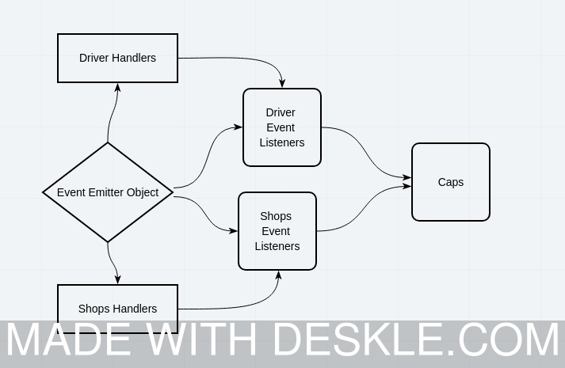

# LAB - Class 11

## Project: CAPS

### Author: OMAR RAMADAN

### Links and Resources

- [ci/cd](http://xyz.com) (GitHub Actions)

### Setup

First install required packages:
`npm install`

Then run the app:
`npm run start`

#### `.env` requirements (where applicable)

- `SHOPNAME` Shop name variable

#### How to initialize/run your application (where applicable)

- `npm start`

#### Tests

First you need to install jest:
`npm install -D jest`

To run the test:
`npm test`

#### UML

